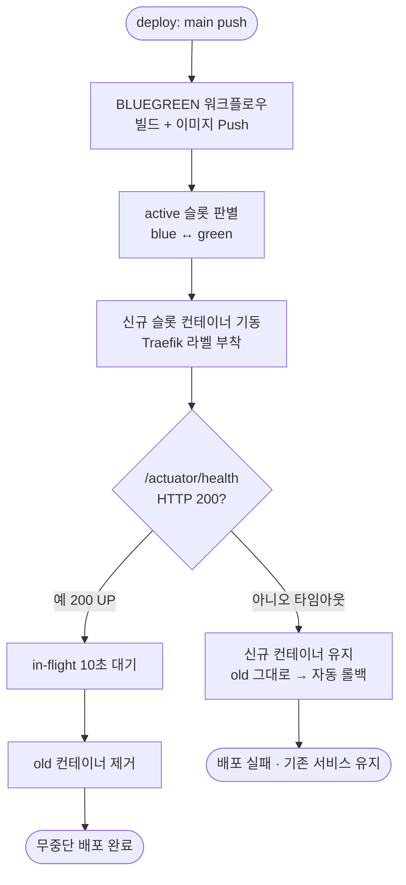

# 무중단 배포 헬스체크 /actuator/health 기반 고도화

## 개요

이슈 #205 로 Traefik Blue-Green 무중단 배포는 이미 완료된 상태였다. 다만 배포 헬스체크가 루트 경로 `/` 호출에 `200|301|302|308` 을 통과로 인정하여, Spring Security 로그인 리다이렉트(302)까지 정상으로 처리됐다. 이는 "컨테이너가 HTTP 응답을 한다"까지만 보장할 뿐 실제 애플리케이션 정상 기동(UP)을 검증하지 못했다.

본 작업은 #205 의 후속 작업으로 명시된 항목으로, 배포 헬스체크를 `/actuator/health` 기반으로 교체하여 실제 App UP 상태만 통과하도록 강화했다. 더불어 #205 의 Mixed Content 수정분(`ForwardedHeaderFilter`)이 원격 main 에 미반영된 채로 발견되어 함께 정리했다.

## 기능 흐름

## 변경 사항

### 백엔드 — actuator health 공개
- `Suh-Web/src/main/java/me/suhsaechan/web/config/PublicEndpointConfig.java`: `getPublicApiEndpoints()` 에 `/actuator/health` 추가. Spring Security 가 헬스체크 요청을 302 로 가로채 로그인 페이지로 보내던 문제 제거.

### 보안 설정 — 리버스 프록시 헤더 신뢰 복원
- `Suh-Web/src/main/java/me/suhsaechan/web/config/WebSecurityConfig.java`: `ForwardedHeaderFilter` 빈 복원. #205 의 Mixed Content 수정분(X-Forwarded-Proto 헤더 신뢰 → HTTPS URL 생성)이 원격 main 에 미반영 상태였던 것을 정리.

### 배포 워크플로우 — 헬스체크 강화
- `.github/workflows/SUH-PROJECT-UTILITY-CICD-BLUEGREEN.yaml`:
  - `HEALTH_CHECK_PATH`: `/` → `/actuator/health`
  - `HEALTH_CHECK_ACCEPT_CODES`: `200|301|302|308` → `200`
  - 결과적으로 actuator 가 `{"status":"UP"}` (HTTP 200) 을 반환할 때만 트래픽 전환이 일어남.

### 시크릿 — actuator health 노출 설정
- GitHub Secret `APPLICATION_YML`: `management.endpoints.web.exposure.include=health` 추가. `application.yml` 이 gitignore 되어 secret 으로 주입되므로 secret 을 직접 갱신. 서버에 배포된 최신 secret 값을 기준으로 management 블록만 병합하여 기존 `flyway`/`minio` 등 설정을 보존.

## 주요 구현 내용

- 헬스체크 신뢰도 향상: 기존에는 로그인 페이지 302 응답도 "정상"으로 간주됐으나, 이제 actuator 가 컨텍스트 로드·의존성 상태를 반영해 `UP` 으로 응답할 때만 통과한다. Spring 컨텍스트가 반쪽만 뜬 상태에서 트래픽이 전환되는 위험을 차단한다.
- secret 갱신의 안전성: secret 값은 직접 읽을 수 없으므로, 현재 prod 컨테이너에 적재된 `application.yml` 을 추출해 기준 원본으로 삼고 management 블록만 추가했다. 로컬 파일이 23 커밋 뒤처져 `flyway`/`minio` 설정이 누락된 상태였던 것을 사전에 비교·검출하여, 전체 덮어쓰기로 인한 설정 유실을 방지했다.

## 배포 검증 결과 (prod, 시놀로지)

| 항목 | 결과 |
|------|------|
| BLUEGREEN 워크플로우 | 자동 트리거 → 빌드·배포 success |
| 슬롯 전환 | blue → green 정상 |
| `/actuator/health` (lab.suhsaechan.kr 경유) | `{"status":"UP"}` — 기존 302 리다이렉트 해소 확인 |
| 루트 `/` | HTTP 200, 무중단 유지 |
| old 컨테이너 | 자동 정리 (컨테이너 1개만 잔존) |

## 주의사항

- `application.yml` 은 gitignore 대상이므로, 향후 설정 변경 시 로컬 파일이 아니라 반드시 GitHub Secret `APPLICATION_YML` 을 갱신해야 배포에 반영된다.
- 로컬 `application.yml` 이 서버 최신 secret 보다 뒤처져 있었다(flyway/minio 누락). 추후 로컬 파일을 서버 기준으로 동기화해 두면 혼선을 줄일 수 있다.
- 무중단 배포(Blue-Green) 자체는 이슈 #205 에서 이미 완성되었으며, 본 작업은 헬스체크 신뢰도만 고도화한 것이다.

Closes #217
