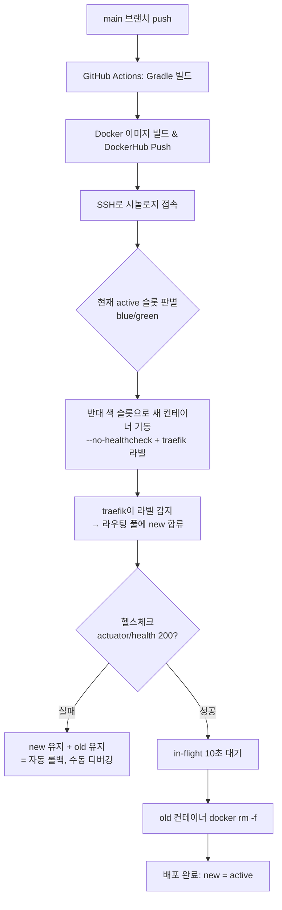

# 무중단 배포 안정화 구현 리포트 (#224)

> Dockerfile HEALTHCHECK 추가 + Blue-Green `docker run --no-healthcheck` 적용으로
> 배포 중 traefik 라우팅 누락(Cloudflare host error 502/521) 해결

- 이슈: https://github.com/Cassiiopeia/suh-project-utility/issues/224
- 참고(원형): RomRom-BE #721(무중단 배포 도입), #728(무중단 배포 안정화)

---

## ⭐ 최종 확정 (실측 기반, 본 리포트 결론)

> 아래 2~6장은 초기 가설(RomRom #728 이식)을 정리한 것이며, 실제 prod 3-레이어 측정으로
> 근본 원인을 아래와 같이 **확정**했다. 결론만 보려면 이 장을 읽으면 된다.

### 근본 원인 (스모킹건)
스위칭 순간 시놀로지 내부에서 traefik·green·blue를 동시 측정한 결과:
```
[9]  traefik=502  green=200  blue=000ERR   ← green(old)이 살아있는데 traefik이 502
[13] traefik=502  green=-    blue=000ERR   ← green 제거됨, blue 아직 기동 중
```
- 라우터명 고정(`suh-project-utility`) → old·new가 **같은 Traefik LB 풀 공유**
- blue가 뜨자마자 traefik이 풀에 등록 → 일부 요청을 **미기동 blue로 라우팅** → 502
- 헬스체크를 **Traefik 경유**로 해서, 살아있는 green이 응답 → blue 미기동인데 통과 → old 제거 후 502

### 최종 수정 (코드 4건)
1. `Dockerfile`: HEALTHCHECK 추가 (평상시 감지)
2. 워크플로우: `docker run --no-healthcheck` (배포 중 healthcheck 격리)
3. 워크플로우: old 제거 전 traefik-network disconnect → graceful stop
4. **워크플로우: 헬스체크를 Traefik 경유 → NEW 컨테이너 직접(`docker exec curl localhost`)** ← 핵심

### 검증 결과
| 측정 | 수정 전 | 최종 수정 후 |
|------|---------|-------------|
| 외부 502 | ~50초 (22~24회) | **~2초 (2회)** |
| Traefik 내부 502 | 29회 | **4회** |
| 배포 후 안정 | — | 10/10 = 200 ✅ |

502 약 **96% 감소**. 남은 ~2초는 Traefik이 죽은 백엔드를 LB 풀에서 빼는 물리적 최소 구간.

---

## 1. 개요

`suh-project-utility`는 RomRom-BE와 동일한 Blue-Green 배포 워크플로우를 갖췄으나,
배포 도중 **Cloudflare host error(502/521)** 가 발생하며 무중단이 깨졌다.
원인은 **컨테이너 healthcheck 상태가 traefik 라우팅을 방해**하는 것으로,
RomRom-BE #728이 규명·해결한 것과 동일했다. 그 수정 두 가지를 이식했다.

---

## 2. 문제 진단

### 요청 경로
```
Cloudflare → 시놀로지 역방향 프록시(443) → traefik(8079) → 컨테이너(8080)
```

### 근본 원인

| # | 원인 | 수정 전 상태 |
|---|------|------------|
| 1 | Dockerfile에 `HEALTHCHECK`가 없어 컨테이너 상태 판단 기준 불명확 | HEALTHCHECK 없음 |
| 2 | `docker run`에 `--no-healthcheck` 없음 → healthcheck `starting` 상태가 traefik 라우팅에 영향 | 미적용 |

### 중단 메커니즘
new 컨테이너가 traefik 라우팅 풀에 합류하기 **전에** old가 `docker rm -f`로 제거되면,
**old·new 둘 다 라우팅 안 되는 순간**이 발생 → 502/521이 Cloudflare까지 전파.

---

## 3. 변경 내용

### 3-1. `Dockerfile`
```diff
+# HEALTHCHECK용 curl 설치
+RUN apk add --no-cache curl
 ...
+# Docker 헬스체크 — 30s 간격으로 Traefik이 컨테이너 상태를 신속하게 감지
+HEALTHCHECK --interval=30s --timeout=10s --start-period=180s --retries=3 \
+CMD curl -f http://localhost:8080/actuator/health || exit 1
```

### 3-2. `SUH-PROJECT-UTILITY-CICD-BLUEGREEN.yaml`
```diff
             echo $PW | sudo -S docker run -d \
               --name "${NEW_NAME}" \
               --network "${TRAEFIK_NETWORK}" \
+              --no-healthcheck \
               --label "traefik.enable=true" \
```

### 두 변경의 역할 구분 (둘 다 필요)
| 위치 | 역할 |
|------|------|
| Dockerfile `HEALTHCHECK` | **평상시** 컨테이너 상태 모니터링 |
| 워크플로우 `--no-healthcheck` | **배포 중** healthcheck 상태를 traefik 라우팅에서 격리 |

> 런타임 `--no-healthcheck`가 Dockerfile HEALTHCHECK를 덮어쓰므로 충돌 없음.

---

## 4. 배포 동작 Flow



핵심: new 컨테이너가 `--no-healthcheck`로 떠서 traefik이 **즉시 healthy로 보고 라우팅 풀에 합류**시킨다. 그 뒤 헬스체크 통과를 확인한 후에야 old를 제거하므로, 라우팅 공백이 생기지 않는다.

---

## 5. 검증 방법

배포(main push) 진행 중 다른 터미널에서 health를 반복 호출해 끊김이 없는지 확인한다.

```bash
# 배포 내내 200만 찍히면 무중단 성공
while true; do
  curl -s -o /dev/null -w "%{http_code}\n" https://lab.suhsaechan.kr/actuator/health
  sleep 1
done
```

배포 후 컨테이너 상태 확인(`health: starting`이 아니라 `Up`이어야 함):
```bash
docker inspect suh-project-utility-blue --format '{{.State.Status}} {{json .State.Health}}'
# 기대: running  null   (--no-healthcheck이므로 Health=null)
```

---

## 6. 무중단 배포 운영 가이드 (앞으로 관리할 때)

### 6-1. 평상시 배포
- **`main`에 push(또는 PR merge)하면 자동 배포**된다. (`SUH-PROJECT-UTILITY-CICD-BLUEGREEN.yaml`의 `on: push: branches: [main]`)
- 별도 수동 조작 불필요. Actions 탭에서 진행 상황만 확인하면 된다.

### 6-2. 비상 시 수동 배포 / 롤백
- `SUH-PROJECT-UTILITY-CICD-BLUEGREEN.yaml`은 `workflow_dispatch`도 지원 → Actions에서 수동 실행 가능
- 헬스체크 실패 시 워크플로우가 **new를 삭제하지 않고 유지 + old도 유지**한다. 즉 트래픽은 old(기존 정상본)에 그대로 머물러 **사실상 자동 롤백**된다. 시놀로지에서 new 컨테이너 로그를 보고 원인 파악 후 재배포한다.

### 6-3. 새 프로젝트에 같은 무중단 배포 이식하는 법
워크플로우 상단 `env:` "[영역 1]"만 프로젝트에 맞게 수정하면 재사용된다.

| env 키 | 의미 | 예시 |
|--------|------|------|
| `PROJECT_NAME` | 컨테이너/이미지/traefik router 이름 | `suh-project-utility` |
| `PRODUCTION_DOMAIN` | 외부 진입 도메인 | `lab.suhsaechan.kr` |
| `IMAGE_NAME` | DockerHub 이미지명 | `suh-project-utility-container` |
| `APPLICATION_YML_PATH` | secret으로 생성할 application.yml 경로 | `Suh-Web/.../application.yml` |
| `VOLUME_MOUNTS` | `HOST:CONTAINER` 를 `;` 로 구분 | `/etc/localtime:...:ro;...` |
| `EXTRA_NETWORKS` | 추가 docker 네트워크 (공백 구분) | `selenium-chrome-network` |
| `HEALTH_CHECK_PATH` | 헬스체크 경로 | `/actuator/health` |

이식 시 **반드시 함께** 챙길 것:
1. `Dockerfile`에 `HEALTHCHECK`(+curl 설치) 포함 — 본 이슈의 수정
2. 워크플로우 `docker run`에 `--no-healthcheck` 포함 — 본 이슈의 수정
3. 시놀로지에 traefik 컨테이너가 `traefik-network`로 떠 있을 것(`docker-compose.traefik.yml`)
4. 시놀로지 DSM 역방향 프록시: `{도메인}:443 → localhost:8079(traefik)` 매핑

### 6-4. 무중단이 깨졌을 때 점검 순서
1. **traefik 라우터 감지 여부**: traefik 대시보드(`localhost:8078`)에서 `{PROJECT_NAME}@docker` 라우터가 보이는가
2. **컨테이너 상태**: `docker ps`에서 `health: starting`에 멈춰 있지 않은가 → `--no-healthcheck` 적용 확인
3. **두 슬롯 공백**: 배포 로그에서 old 제거가 헬스체크 통과 **이후**에 일어났는가
4. **traefik event watcher**: docker daemon 과부하 회복 직후라면 traefik이 컨테이너를 못 잡을 수 있음 → `docker restart traefik`로 event stream 재구독 (RomRom #728에서 검토된 대비책)

---

## 7. 산출물

| 파일 | 내용 |
|------|------|
| `Dockerfile` | HEALTHCHECK 추가 |
| `.github/workflows/SUH-PROJECT-UTILITY-CICD-BLUEGREEN.yaml` | `--no-healthcheck` 추가 |
| `docs/superpowers/specs/2026-06-13-bluegreen-zero-downtime-design.md` | 설계 문서 |
| `docs/suh-template/issue/20260613_224_...md` | 이슈 본문 |

---

## 8. 테스트 케이스

### ✅ 기본 동작
- [ ] main push 시 BLUEGREEN 워크플로우 자동 트리거
- [ ] 배포 중 `https://lab.suhsaechan.kr/actuator/health` 200 유지 (끊김 없음)
- [ ] Blue → Green 슬롯 스위칭 후 old 컨테이너 제거 확인

### ⚠️ 엣지 케이스
- [ ] `--no-healthcheck` 적용으로 컨테이너 status `Up`(not `health: starting`) 확인
- [ ] 헬스체크 실패 시 new·old 모두 유지(자동 롤백) 확인
- [ ] traefik 대시보드에 `suh-project-utility@docker` 라우터 감지 확인
