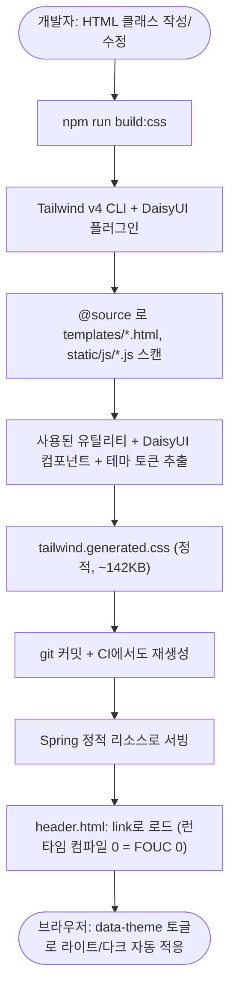

# UI 다크모드 DaisyUI 네이티브 테마 전환

## 개요

Spring Boot + Thymeleaf 프로젝트에서 다크모드가 일관되게 동작하지 않던 근본 원인은, Tailwind v3 런타임 CDN(`cdn.tailwindcss.com`)과 Tailwind v4 토큰 시스템을 전제로 한 DaisyUI 5를 함께 로드한 **비호환 조합**이었다. 이 때문에 `base-100`·`base-content` 같은 시맨틱 색이 테마에 따라 자동으로 바뀌지 않았고, 이를 가리려고 `common.css`에 `[data-theme="dark"]` 수동 오버라이드(409개)와 `!important`(549개)가 누적돼 유지보수가 사실상 불가능했다.

해결책으로 **Tailwind v4 + DaisyUI 5를 빌드타임에 정적 CSS로 컴파일**하는 방식으로 전환했다. 브라우저 런타임 컴파일을 제거해 과거 시도가 revert됐던 FOUC 문제를 근본 차단하고, DaisyUI 네이티브 테마가 정상 동작하도록 만들었다. 이 문서는 **다른 프로젝트에 동일 방식을 적용하기 위한 재사용 가이드**를 겸한다.

## 기능 흐름



## 변경 사항

### 빌드 셋업 (신규)
- `Suh-Web/frontend/package.json`: `build:css` 스크립트 + devDependencies(`tailwindcss@4`, `@tailwindcss/cli@4`, `daisyui@5`)
- `Suh-Web/frontend/tailwind.input.css`: `@import "tailwindcss"` + `@source` 지시어 + `@plugin "daisyui"` 테마 등록 + `@custom-variant dark`
- `Suh-Web/frontend/package-lock.json`: 버전 고정(공식 registry URL로 정규화하여 커밋 — CI `npm ci` 호환)
- `Suh-Web/src/main/resources/static/css/tailwind.generated.css`: **빌드 산출물(커밋)**, ~142KB
- `.gitignore`: `Suh-Web/frontend/node_modules/` 추가

### 템플릿/스타일
- `fragments/header.html`: `cdn.tailwindcss.com`(v3 런타임)·`daisyui@5.4.2/daisyui.css`·`tailwind.config` JS 제거 → `tailwind.generated.css` `<link>` 추가(common.css보다 먼저 로드)
- `static/css/common.css`: DaisyUI 컴포넌트 색 수동 오버라이드·버튼 색 보강·`devops-*` 블록 제거(3,737 → 3,479줄). 순수 커스텀(`.version-badge`, 파스텔 배지, `.bg-white` 유틸 오버라이드 등)은 보존
- `static/js/common.js`: 테마 토글을 light일 때도 `data-theme="light"` 명시(header FOUC 스크립트와 일관화)
- 페이지 16개: 하드코딩 색상(`bg-white`, `text-gray-*`, `bg-blue-500` 등)을 DaisyUI 시맨틱 토큰(`bg-base-100`, `text-base-content`, `bg-primary` 등)으로 치환
- `pages/suhDevopsTemplate.html`: 7탭 단일 페이지로 전면 개편(개요/적용/명령어/마법사/워크플로우/AI 스킬/설정), 시맨틱 토큰만 사용 (이슈 #208)

### CI
- `SUH-PROJECT-UTILITY-CICD-BLUEGREEN.yaml` / `SUH-PROJECT-UTILITY-CICD.yaml` / `PROJECT-SPRING-SYNOLOGY-PR-PREVIEW.yaml`: Gradle 빌드 직전에 Node 셋업 + `npm ci` + `npm run build:css` 스텝 추가 → CI에서도 항상 최신 HTML 기준으로 CSS 재생성

## 주요 구현 내용 — Spring Boot에 Tailwind + DaisyUI 통합 (재사용 절차)

다른 프로젝트에 적용할 때 이 순서를 그대로 따른다.

### 1. 프론트 빌드 디렉토리 생성 `{모듈}/frontend/`

`package.json`:
```json
{
  "name": "web-frontend",
  "private": true,
  "version": "1.0.0",
  "scripts": {
    "build:css": "tailwindcss -i ./tailwind.input.css -o ../src/main/resources/static/css/tailwind.generated.css --minify"
  },
  "devDependencies": {
    "@tailwindcss/cli": "^4.3.1",
    "tailwindcss": "^4.3.1",
    "daisyui": "^5.5.23"
  }
}
```

`tailwind.input.css`:
```css
@import "tailwindcss";

/* ⚠️ 핵심: @source 로 스캔 대상을 명시한다. 이게 없으면 유틸리티가 생성되지 않는다 */
@source "../src/main/resources/templates/**/*.html";
@source "../src/main/resources/static/js/**/*.js";

@plugin "daisyui" {
  themes: light --default, dark --prefersdark;
}

/* data-theme="dark" 속성 기반 다크 variant */
@custom-variant dark (&:where([data-theme="dark"], [data-theme="dark"] *));

/* JS가 문자열로 동적 생성해 정적 스캔이 놓치는 클래스 보강 */
@source inline("badge-{primary,secondary,info,success,warning,error,ghost,neutral}");
@source inline("btn-{primary,secondary,info,success,warning,error,ghost,outline,neutral}");
@source inline("bg-{primary,secondary,info,success,warning,error,neutral,accent}");
@source inline("alert-{info,success,warning,error}");
```

### 2. CSS 생성 + 커밋
```bash
cd {모듈}/frontend
npm install
npm run build:css   # → static/css/tailwind.generated.css 생성
```
- 생성물 `tailwind.generated.css`는 **git에 커밋**한다(로컬 빌드 + 커밋 방식). Spring은 이 정적 파일을 서빙만 한다.
- `node_modules/`는 `.gitignore`에 추가. `package-lock.json`은 커밋(버전 고정).

### 3. header에 연결 (CDN 런타임 제거)
```html
<!-- 제거: cdn.tailwindcss.com, daisyui CDN link, tailwind.config JS -->
<!-- 추가: 생성된 정적 CSS (common.css 등 다른 CSS보다 먼저 로드) -->
<link rel="stylesheet" type="text/css" th:href="@{/css/tailwind.generated.css}"/>
```
- FOUC 방지: head 최상단 인라인 스크립트로 `data-theme`를 즉시 설정한다(라이트일 때도 `data-theme="light"` 명시).

### 4. 테마 토글 (JS)
- `localStorage`에 `theme`(`dark`/`light`) 저장, `document.documentElement.setAttribute('data-theme', ...)`로 적용.
- DaisyUI `theme-controller` 체크박스(`<input type="checkbox" class="theme-controller" value="dark">`)와 호환된다.

### 5. CI 자동 재생성 (Gradle 빌드 직전)
```yaml
- name: Node.js 설정
  uses: actions/setup-node@v4
  with:
    node-version: '20'

- name: Tailwind CSS 빌드 (DaisyUI 정적 생성)
  run: |
    cd {모듈}/frontend
    npm ci
    npm run build:css

# 이후 기존 Gradle 빌드 스텝
```
- CI runner는 외부망이므로 공식 npm registry를 그대로 사용한다. `package-lock.json`을 커밋했으면 `npm ci`, 아니면 `npm install`.

### 6. HTML은 시맨틱 토큰만 사용
- 하드코딩 색(`bg-white`, `text-gray-700`, `bg-blue-500`) 대신 DaisyUI 시맨틱 토큰(`bg-base-100`, `text-base-content`, `bg-primary`)을 쓴다. 그래야 다크/라이트가 테마 단일 출처로 자동 적응한다.
- 매핑: `bg-white/gray-50→bg-base-100/200`, `text-gray-*→text-base-content[/70]`, `border-gray-*→border-base-300`, `bg-blue→primary`, `green→success`, `red→error`, `amber/yellow→warning`, `cyan/sky→info`.

## 트러블슈팅 기록

### 증상
배포 후 화면이 깨져 보임. 텍스트·아이콘·배지 색은 나오는데 카드·그리드·간격 등 **레이아웃이 전부 무너져** 세로로 늘어짐.

### 1차 오진 — MIME
초기엔 콘솔의 `Refused to apply style ... MIME type ('application/json')` 에러를 보고 "MIME 설정 문제"로 판단했다. 실제로는 **`tailwind.generated.css`가 아직 운영에 배포되지 않아** Spring이 정적 파일 부재 시 JSON 에러를 응답한 것이었고, 이는 파일을 커밋·배포하자 사라졌다. (`application.yml`의 `application/json` 설정은 `springdoc:` 하위 = Swagger 전용이라 정적 CSS와 무관함을 확인.)

### 진짜 원인 — @source 누락
MIME 에러가 사라진 뒤에도 레이아웃이 깨졌다. 생성된 CSS를 검사하니:
- 크기가 **13.7KB**에 불과 (정상은 ~142KB)
- `grep -c '\.grid' tailwind.generated.css` = **0** — `grid`·`flex`·`p-4`·`card`·`max-w-7xl` 등 유틸리티 클래스가 **하나도 생성되지 않음**. DaisyUI 컴포넌트와 테마 토큰만 들어 있었다.

원인은 Tailwind v4 CLI의 `--content "glob"` 플래그가 빌드 시 HTML을 스캔하지 못한 것. **Tailwind v4에서는 `tailwind.input.css`에 `@source` 지시어로 스캔 대상을 명시해야 한다.**

### 해결
`tailwind.input.css`에 `@source "../src/main/resources/templates/**/*.html"`(및 js) 추가, `package.json`에서 작동하지 않는 `--content` 플래그 제거. 재빌드 결과 **13.7KB → 142.7KB**, 유틸리티 클래스 정상 생성 → 레이아웃 복구.

### 검증법
```bash
npm run build:css
wc -c tailwind.generated.css          # 140KB대면 정상, 13KB대면 스캔 실패 의심
grep -c '\.grid' tailwind.generated.css   # 0이면 @source 누락
```

## 주의사항

- **`@source` 누락 = 유틸리티 0개**가 가장 빠지기 쉬운 함정이다. 빌드 후 파일 크기(140KB대)와 `.grid` 존재 여부로 즉시 검증할 것.
- "MIME application/json 거부" 에러와 "MIME 정상인데 레이아웃 깨짐"은 원인이 다르다 — 전자는 파일 미배포, 후자는 `@source` 누락. 혼동하지 말 것.
- 생성물을 커밋하므로, HTML 클래스를 추가/변경하면 `npm run build:css`로 재생성해야 한다. CI에도 빌드 스텝을 넣어 두면 커밋 누락 시에도 항상 최신 CSS가 jar에 들어간다.
- `common.css`에 남은 `@import url(...)` 폰트 로드 한 줄은 스타일시트 중간에 있어 브라우저가 무시(경고만 발생)한다. 화면 깨짐과 무관하나, 추후 head의 `<link>`로 옮기는 게 좋다.
- `package-lock.json`을 로컬 사내 미러 환경에서 생성하면 `resolved` URL이 미러 주소로 박힌다. CI(외부망)에서 `npm ci`가 동작하려면 공식 registry URL(`registry.npmjs.org`)로 정규화한 lock을 커밋해야 한다.

---

# 부록 — 백지 Spring 프로젝트에 0부터 적용하는 완전 가이드

> **이 부록 하나만 보고 다른 Spring Boot + Thymeleaf 프로젝트에 그대로 적용할 수 있도록** 모든 파일 전체 코드와 검증법을 담았다. 위 본문은 "이 프로젝트에서 무슨 일이 있었나"이고, 아래는 "새 프로젝트에 어떻게 하나"다.

## 0. 배경 — 왜 CDN이 아니라 빌드타임인가 (다시 CDN 유혹에 빠지지 않기 위해)

| 방식 | 문제 |
|------|------|
| `cdn.tailwindcss.com` (Tailwind v3 Play CDN) | DaisyUI 5는 **Tailwind v4의 `@theme`/`@plugin` 토큰 시스템 전제**라, v3 CDN과 조합하면 `btn-primary`·`base-100` 등 **색 토큰이 안 깔린다**. (비호환) |
| `@tailwindcss/browser@4` (v4 브라우저 런타임 CDN) | 정합 조합이지만 **브라우저가 페이지 로드마다 CSS를 런타임 컴파일** → **FOUC**(처음에 스타일 없는 화면 번쩍), 초기 렌더 지연. 내부망 검증도 어려움. |
| **빌드타임 정적 CSS (이 방식)** | `@tailwindcss/cli`로 **미리 한 번 컴파일** → 완성된 `.css`를 커밋 → 브라우저는 `<link>`로 받기만 함. **런타임 컴파일 0 = FOUC 0**, 다크모드 네이티브 정상. Spring은 정적 파일 서빙만. |

**결론: 운영 웹앱이면 빌드타임이 정답이다.** 위 표를 기억하면 "그냥 CDN 한 줄로 끝내자"는 유혹을 막을 수 있다.

전제 조건: 빌드 머신(로컬 또는 CI)에 **Node.js 20+ / npm**이 있어야 한다. npm registry 접근 가능해야 한다(공식 또는 사내 미러).

## 1. 디렉토리 구조 (목표)

```
{web-module}/                       # 예: Suh-Web
├── frontend/                       # ★ 신규 생성
│   ├── package.json                # 빌드 스크립트 + 의존성
│   ├── package-lock.json           # 커밋 (버전 고정)
│   ├── tailwind.input.css          # Tailwind/DaisyUI 진입점
│   └── node_modules/               # .gitignore (커밋 안 함)
└── src/main/resources/
    ├── static/css/
    │   ├── tailwind.generated.css  # ★ 빌드 산출물 (커밋!)
    │   └── common.css              # (선택) 커스텀 스타일
    ├── static/js/common.js         # 테마 토글 로직
    └── templates/
        ├── fragments/header.html   # CSS link + FOUC 스크립트
        └── pages/*.html            # 시맨틱 토큰 사용
```

## 2. 파일별 전체 코드 (그대로 복붙)

### 2-1. `{web-module}/frontend/package.json`
```json
{
  "name": "web-frontend",
  "private": true,
  "version": "1.0.0",
  "scripts": {
    "build:css": "tailwindcss -i ./tailwind.input.css -o ../src/main/resources/static/css/tailwind.generated.css --minify"
  },
  "devDependencies": {
    "@tailwindcss/cli": "^4.3.1",
    "tailwindcss": "^4.3.1",
    "daisyui": "^5.5.23"
  }
}
```
> `-o` 경로는 본인 프로젝트의 `static/css/` 위치에 맞춘다. `frontend/`가 web 모듈 바로 아래면 위 상대경로 그대로면 된다.

### 2-2. `{web-module}/frontend/tailwind.input.css`
```css
@import "tailwindcss";

/* ★ 가장 중요: @source 로 스캔할 파일을 명시한다.
   이게 없으면 grid/flex/p-4 같은 유틸리티가 0개 생성되어 레이아웃이 다 깨진다.
   경로는 frontend/ 기준 상대경로. 본인 프로젝트 구조에 맞게 조정. */
@source "../src/main/resources/templates/**/*.html";
@source "../src/main/resources/static/js/**/*.js";

/* DaisyUI 플러그인 + 라이트/다크 테마 등록 */
@plugin "daisyui" {
  themes: light --default, dark --prefersdark;
}

/* data-theme="dark" 속성 기반 다크 variant (Thymeleaf/JS 토글과 연동) */
@custom-variant dark (&:where([data-theme="dark"], [data-theme="dark"] *));

/* JS가 문자열로 동적 생성하는 클래스는 정적 스캔이 못 잡으므로 safelist 보강.
   (예: el.innerHTML = `<span class="badge-${type}">` 같은 코드)
   본인 프로젝트에서 JS로 동적 생성하는 클래스 패턴이 있으면 여기 추가. */
@source inline("badge-{primary,secondary,info,success,warning,error,ghost,neutral}");
@source inline("btn-{primary,secondary,info,success,warning,error,ghost,outline,neutral}");
@source inline("bg-{primary,secondary,info,success,warning,error,neutral,accent}");
@source inline("alert-{info,success,warning,error}");
```

### 2-3. `fragments/header.html` — head 구성
head fragment 안에서 (1) **최상단에 FOUC 방지 스크립트**, (2) **생성 CSS link를 다른 CSS보다 먼저** 둔다. CDN 관련 라인(`cdn.tailwindcss.com`, `daisyui CDN link`, `tailwind.config` JS)은 **전부 제거**한다.
```html
<head th:fragment="head(title)">
  <meta charset="UTF-8">
  <meta name="viewport" content="width=device-width, initial-scale=1.0">
  <title th:text="${title}">Default Title</title>

  <!-- 테마 즉시 적용 (FOUC 방지) — 반드시 CSS link보다 먼저, head 최상단 -->
  <script>
    (function() {
      var theme = localStorage.getItem('theme');
      if (theme === 'dark') {
        document.documentElement.setAttribute('data-theme', 'dark');
      } else {
        document.documentElement.setAttribute('data-theme', 'light');
      }
    })();
  </script>

  <!-- 빌드타임 생성 CSS (Tailwind + DaisyUI). 다른 커스텀 CSS보다 먼저 로드 -->
  <link rel="stylesheet" type="text/css" th:href="@{/css/tailwind.generated.css}"/>

  <!-- 커스텀 CSS가 있다면 그 다음 (생성 CSS를 오버라이드할 수 있게) -->
  <link rel="stylesheet" type="text/css" th:href="@{/css/common.css}"/>

  <!-- Font Awesome 등 나머지 -->
</head>
```

### 2-4. `static/js/common.js` — 테마 토글 (전체)
DaisyUI `theme-controller` 체크박스와 연동된다. `initTheme()`를 `$(document).ready` 또는 `DOMContentLoaded`에서 호출한다.
```javascript
function initTheme() {
  const savedTheme = localStorage.getItem('theme');
  const isDark = savedTheme === 'dark';

  // light일 때도 data-theme="light"를 명시 (header FOUC 스크립트와 일관 — DaisyUI light --default)
  if (isDark) {
    document.documentElement.setAttribute('data-theme', 'dark');
  } else {
    document.documentElement.setAttribute('data-theme', 'light');
  }

  // 모든 테마 토글 체크박스 상태 동기화
  const themeToggles = document.querySelectorAll('.theme-controller');
  themeToggles.forEach(function(toggle) {
    toggle.checked = isDark;
  });

  // change 이벤트로 테마 전환
  themeToggles.forEach(function(toggle) {
    toggle.addEventListener('change', function() {
      const newTheme = this.checked ? 'dark' : 'light';
      localStorage.setItem('theme', newTheme);
      document.documentElement.setAttribute('data-theme', newTheme);
      themeToggles.forEach(function(other) {
        if (other !== toggle) other.checked = toggle.checked;
      });
    });
  });
}
```
토글 버튼 마크업 예시(헤더 어딘가):
```html
<label class="swap swap-rotate">
  <input type="checkbox" class="theme-controller" value="dark" />
  <svg class="swap-off ..."><!-- 해 아이콘 --></svg>
  <svg class="swap-on ..."><!-- 달 아이콘 --></svg>
</label>
```

### 2-5. `.gitignore`
```
{web-module}/frontend/node_modules/
```
> `package-lock.json`은 **커밋한다**(버전 고정). `tailwind.generated.css`도 **커밋한다**(빌드 산출물).

### 2-6. CI 워크플로우 — Gradle 빌드 직전에 삽입
빌드하는 모든 워크플로우(메인 배포 / PR preview 등)의 **Gradle 빌드 스텝 바로 앞**에 넣는다.
```yaml
- name: Node.js 설정
  uses: actions/setup-node@v4
  with:
    node-version: '20'

- name: Tailwind CSS 빌드 (DaisyUI 정적 생성)
  run: |
    cd {web-module}/frontend
    npm ci
    npm run build:css

# ↓ 기존 Gradle 빌드 스텝
- name: Gradle 빌드
  run: ./gradlew clean build ...
```
> CI runner는 외부망이라 공식 npm registry를 그대로 쓴다. lock을 커밋했으면 `npm ci`(빠르고 결정적), 안 했으면 `npm install`.

## 3. 적용 순서 (체크리스트)

```
□ 1. {web-module}/frontend/ 폴더 생성
□ 2. package.json, tailwind.input.css 작성 (위 2-1, 2-2)
□ 3. cd frontend && npm install
□ 4. npm run build:css  →  static/css/tailwind.generated.css 생성 확인
□ 5. ★ 검증: 생성 CSS 크기 & 유틸리티 존재 (아래 4번)
□ 6. header.html: CDN 라인 제거 + FOUC 스크립트 + 생성 CSS link (2-3)
□ 7. common.js: initTheme() 추가 + ready에서 호출 (2-4)
□ 8. .gitignore: node_modules 제외 (2-5)
□ 9. 페이지 HTML: 하드코딩 색 → 시맨틱 토큰 치환 (아래 5번 치트시트)
□ 10. CI 워크플로우: CSS 빌드 스텝 추가 (2-6)
□ 11. git add (node_modules 빼고) → commit → push → 배포
□ 12. 운영에서 라이트/다크 토글 + 레이아웃 육안 확인
```

## 4. 검증 — "성공" 판정 기준 (반드시 확인)

```bash
cd {web-module}/frontend && npm run build:css
cd ../..

# (1) 파일 크기: 140KB 안팎이면 정상. 13KB대면 @source 누락 의심!
wc -c src/main/resources/static/css/tailwind.generated.css

# (2) 유틸리티 클래스 생성 확인: 0이면 스캔 실패 = @source 문제
grep -c '\.grid'   src/main/resources/static/css/tailwind.generated.css   # ≥1
grep -c '\.flex'   src/main/resources/static/css/tailwind.generated.css   # ≥1
grep -c '\.card'   src/main/resources/static/css/tailwind.generated.css   # ≥1

# (3) 다크 테마 토큰 + 컴포넌트 색 확인
grep -c 'data-theme=dark'  src/main/resources/static/css/tailwind.generated.css  # ≥1
grep -c '\-\-color-primary' src/main/resources/static/css/tailwind.generated.css # ≥1

# (4) 순수 정적인지 (런타임 JS 0 = FOUC 없음)
grep -c '<script\|cdn.tailwindcss' src/main/resources/static/css/tailwind.generated.css  # 0
```
**`.grid`가 0이거나 파일이 13KB대면 → `tailwind.input.css`의 `@source` 경로가 실제 HTML을 못 가리키는 것.** 경로를 `frontend/` 기준 상대경로로 맞춰라.

## 5. 색상 치트시트 — 하드코딩 → DaisyUI 시맨틱 토큰

페이지 HTML에서 아래처럼 바꿔야 다크/라이트가 자동 적응한다.

| 하드코딩 (쓰지 말 것) | 시맨틱 토큰 (이걸로) | 의미 |
|---|---|---|
| `bg-white`, `bg-gray-50/100` | `bg-base-100`, `bg-base-200` | 표면/카드 배경 |
| `bg-gray-800/900` | `bg-base-300`, `bg-neutral` | 진한 배경 |
| `text-gray-400/500/600` | `text-base-content/60`, `/70` | 보조 텍스트 |
| `text-gray-700/800/900`, `text-black` | `text-base-content` | 본문 텍스트 |
| `text-white` (중립 배경 위) | `text-neutral-content`, `text-base-100` | 반전 텍스트 |
| `border-gray-200/300` | `border-base-300` | 테두리 |
| `bg-blue-*`, `text-blue-*` | `bg-primary`, `text-primary` | 주요 색 |
| `bg-green-*` | `bg-success` | 성공/정상 |
| `bg-red-*` | `bg-error` | 실패/위험 |
| `bg-amber-*`, `bg-yellow-*` | `bg-warning` | 경고 |
| `bg-cyan-*`, `bg-sky-*` | `bg-info` | 정보 |
| `bg-indigo/purple/violet-*` | `bg-primary` 또는 `bg-secondary` | 강조 (맥락) |

DaisyUI 컴포넌트(자동 테마 적응): `card`, `btn btn-primary/error/success/info/warning/ghost/outline`, `badge badge-*`, `alert alert-*`, `tabs tabs-lift`, `table table-zebra`, `select select-bordered`, `modal modal-box`, `mockup-code`, `collapse`, `navbar`, `dropdown`.

> **주의: 의미가 특정 색에 묶인 곳**(브랜드 로고 색, 차트 색, 고정 라이트 그라데이션 히어로 위 텍스트 등)은 시맨틱으로 바꾸면 오히려 깨진다 — 그런 곳은 보존하고 주석으로 사유를 남긴다.

## 6. FAQ / 자주 빠지는 함정

**Q. 화면이 깨진다 — 색은 나오는데 레이아웃(카드/그리드/간격)이 다 무너짐.**
→ `@source` 누락으로 유틸리티가 0개 생성된 것. 4번 검증으로 `.grid` 카운트와 파일 크기를 확인. `tailwind.input.css`에 `@source "...templates/**/*.html"`이 있는지, 경로가 맞는지 본다.

**Q. 콘솔에 `Refused to apply style ... MIME type ('application/json')`.**
→ 보통 `tailwind.generated.css`가 **아직 운영에 배포 안 됨**. Spring이 정적 파일 부재 시 JSON 에러를 응답해서다. 파일을 커밋·배포하면 해결. (`.css → text/css`는 Spring 기본 매핑이라 별도 설정 불필요.) `springdoc`의 `default-produces-media-type: application/json`은 Swagger 전용이라 정적 CSS와 무관하다.

**Q. 처음 로드 시 흰 화면이 번쩍인다(FOUC).**
→ header 최상단 FOUC 스크립트가 CSS link보다 **앞에** 있는지 확인. 빌드타임 방식이면 런타임 컴파일이 없어 FOUC가 없어야 정상.

**Q. JS로 동적 생성한 배지/버튼 색이 안 나온다.**
→ 정적 스캔이 그 클래스를 못 잡은 것. `tailwind.input.css`의 `@source inline(...)` safelist에 해당 패턴 추가.

**Q. 새 클래스를 HTML에 추가했는데 스타일이 안 먹는다.**
→ `npm run build:css` 재실행 후 커밋. CI에 빌드 스텝이 있으면 커밋만 해도 CI가 재생성한다.

**Q. CI에서 `npm ci`가 실패한다.**
→ `package-lock.json`의 `resolved` URL이 사내 미러 주소면 외부망 CI에서 실패한다. 공식 `registry.npmjs.org` URL로 정규화한 lock을 커밋하거나, lock을 안 쓰고 `npm install`로 바꾼다.

**Q. 다크모드인데 일부 영역만 흰 배경으로 남는다.**
→ 그 영역이 `bg-white`/`text-gray-*` 하드코딩을 쓰고 있는 것. 5번 치트시트로 시맨틱 토큰 치환.

## 7. 한 줄 요약
**`@source`로 HTML/JS를 스캔해 Tailwind v4 + DaisyUI를 빌드타임에 정적 `.css`로 컴파일 → 커밋 → header에서 `<link>`로 로드. CDN 런타임 제거로 FOUC 0, 다크모드 네이티브 자동 적응. 깨지면 제일 먼저 `@source`와 생성 CSS 크기(140KB)를 의심하라.**
