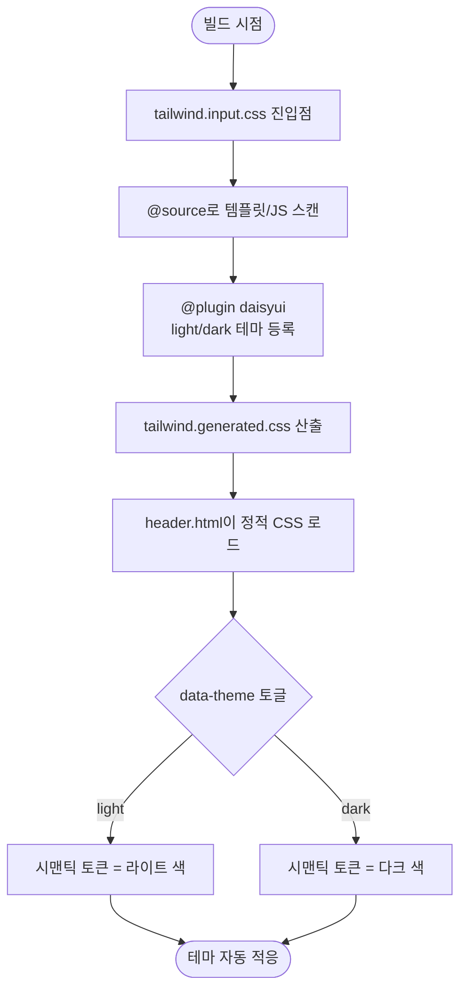

# 다크모드를 DaisyUI 네이티브 테마 시스템으로 전환

## 개요

전 페이지에서 다크모드가 일관되게 동작하지 않던 문제를 해결했다. 근본 원인은 Tailwind v3 런타임 CDN과 Tailwind v4 토큰 시스템을 전제로 만들어진 DaisyUI 5의 비호환 조합이었고, 이를 가리려 `common.css`에 `[data-theme="dark"] .xxx { ... !important }` 형태의 수동 오버라이드를 누적해 온 악순환 구조였다. **Tailwind v4 + DaisyUI 5를 빌드타임에 정적 CSS로 컴파일**하는 방식으로 전환해, 라이트/다크 테마에 따라 시맨틱 색이 자동 적용되도록 했다. CDN 런타임 컴파일을 제거해 직전 v4 시도(revert됨)의 FOUC·내부망 검증 불가 리스크도 함께 해소했다.

## 기능 흐름

## 변경 사항

### 빌드타임 CSS 셋업 도입

- `Suh-Web/frontend/tailwind.input.css`: Tailwind/DaisyUI 진입점. `@import "tailwindcss"`, `@source`(템플릿·JS 스캔 경로), `@plugin "daisyui"`(light `--default` / dark `--prefersdark` 테마 등록), `@custom-variant dark`, 동적 클래스 safelist(`@source inline`) 정의.
- `Suh-Web/frontend/package.json`: `build:css` 스크립트 및 Tailwind/DaisyUI 빌드 의존성.
- `Suh-Web/src/main/resources/static/css/tailwind.generated.css`: 빌드 산출물(약 142KB). 직접 편집하지 않고 `npm run build:css`로만 재생성.

### 테마 로딩 경로 전환

- `Suh-Web/src/main/resources/templates/fragments/header.html`: `cdn.tailwindcss.com`(v3 런타임) 로드를 제거하고 빌드 산출물 `@{/css/tailwind.generated.css}`를 로드하도록 변경. DaisyUI 네이티브 테마 토큰이 실제로 적용되는 정합 조합으로 맞췄다.

## 주요 구현 내용

핵심은 **테마 색의 단일 출처를 DaisyUI 네이티브 테마 시스템으로 옮긴 것**이다. 기존에는 Tailwind v3 런타임 CDN과 DaisyUI 5가 비호환이라 `base-100`·`base-content` 같은 시맨틱 색이 테마에 따라 자동으로 바뀌지 않았고, 그 빈틈을 `common.css`의 수동 `[data-theme="dark"]` 오버라이드로 일일이 메워 왔다. 새 마크업을 추가할 때마다 다크모드가 깨지고 또 `!important`로 막는 유지보수 불가능한 구조였다.

빌드타임 컴파일로 전환하면서 `tailwind.input.css`의 `@plugin "daisyui"`에 light/dark 테마를 등록하면, DaisyUI가 `data-theme` 속성에 따라 시맨틱 토큰을 테마별로 알아서 칠한다. 즉 마크업은 `bg-base-100`·`text-base-content` 같은 토큰만 쓰면 되고, 다크/라이트 분기는 테마 시스템이 단일 출처로 처리한다. CDN 런타임 컴파일을 없앤 덕분에 직전 v4 시도에서 revert 사유였던 초기 렌더 지연(FOUC)과 내부망 검증 불가 문제도 사라졌다 — 정적 CSS는 빌드 시점에 이미 완성돼 있기 때문이다.

향후 가이드(하드코딩 색상 금지, 시맨틱 토큰 사용, `tailwind.generated.css` 직접 편집 금지, 새 클래스 추가 후 `npm run build:css` 재생성)는 `CLAUDE.md`의 CSS/DaisyUI 아키텍처 섹션에 명문화했다.

## 주의사항

- `common.css`에는 아직 `[data-theme="dark"]` 수동 오버라이드가 다수 남아 있다. 이슈의 핵심 목표인 "DaisyUI 네이티브 테마 전환"은 완료됐으나, 페이지별 하드코딩 색상 → 시맨틱 토큰 점진 치환과 그에 따른 잔존 오버라이드 제거는 페이지 단위 후속 정리 대상이다.
- HTML/JS에 새 시맨틱 클래스를 추가하면 반드시 `cd Suh-Web/frontend && npm run build:css`로 재생성해야 `tailwind.generated.css`에 반영된다. 빌드 후 파일 크기가 13KB대로 떨어지면 `@source` 경로 누락(유틸리티 0개 생성)이므로 입력 CSS의 `@source`를 확인해야 한다.
