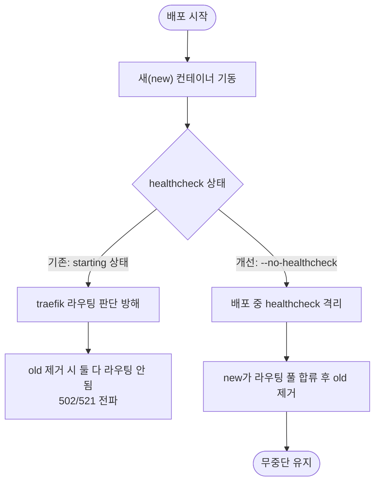

# 무중단 배포 안정화 — Dockerfile HEALTHCHECK 및 --no-healthcheck 적용

## 개요

Blue-Green 배포 워크플로우가 도입돼 있었으나 배포 도중 Cloudflare host error(502/521)가 발생하며 무중단이 깨졌다. 근본 원인은 컨테이너 healthcheck 상태가 traefik 라우팅 판단을 방해하는 것이었다. RomRom-BE #728에서 규명·해결한 동일 패턴을 적용해, `Dockerfile`에는 평상시 모니터링용 `HEALTHCHECK`를 추가하고 배포 워크플로우의 `docker run`에는 배포 순간 격리용 `--no-healthcheck`를 추가했다.

## 기능 흐름

## 변경 사항

### 컨테이너 헬스체크 (평상시 모니터링)

- `Dockerfile`: `curl` 설치(`apk add --no-cache curl`) 후 `HEALTHCHECK --interval=30s --timeout=10s --start-period=180s --retries=3 CMD curl -f http://localhost:8080/actuator/health` 추가. 평상시 traefik이 컨테이너 상태를 30초 내 신속 감지할 수 있게 한다.

### 배포 워크플로우 (배포 중 격리)

- `.github/workflows/SUH-PROJECT-UTILITY-CICD-BLUEGREEN.yaml`: 새 컨테이너 기동 `docker run`에 `--no-healthcheck` 추가. 배포 순간 healthcheck `starting` 상태가 traefik 라우팅 판단에 끼어들지 않도록 격리한다.

## 주요 구현 내용

요청 경로는 `Cloudflare → 시놀로지 역방향 프록시(443) → traefik(8079) → 컨테이너(8080)`이다. Blue-Green 전환 시 new 컨테이너가 traefik 라우팅 풀에 합류하기 전에 old가 `docker rm -f`로 제거되면, 둘 다 라우팅되지 않는 순간이 생겨 502/521이 Cloudflare까지 전파됐다.

두 변경은 역할이 다르다. **Dockerfile HEALTHCHECK는 평상시 모니터링용**으로, traefik이 정상 운영 중인 컨테이너의 건강 상태를 빠르게 파악하게 한다. **워크플로우 `--no-healthcheck`는 배포 중 격리용**으로, 컨테이너 기동 직후의 `starting` 상태가 라우팅 판단에 영향을 주지 않게 한다. 런타임 `--no-healthcheck`가 Dockerfile의 HEALTHCHECK를 덮어쓰므로 둘 사이에 충돌이 없다 — 배포 순간에는 격리되고, 평상시에는 모니터링이 동작하는 구조다.

## 주의사항

- `--no-healthcheck`로 기동된 컨테이너는 배포 직후 Docker healthcheck 상태가 보고되지 않으므로, 컨테이너 자체의 기동 완료 여부는 `actuator/health`를 외부에서 직접 호출해 검증해야 한다(워크플로우의 무중단 검증 단계 참고).
- HEALTHCHECK의 `start-period=180s`는 애플리케이션 콜드 스타트 시간을 고려한 값이다. 기동 시간이 늘어나면 이 값을 함께 조정해야 healthcheck가 조기에 실패로 판정하지 않는다.
