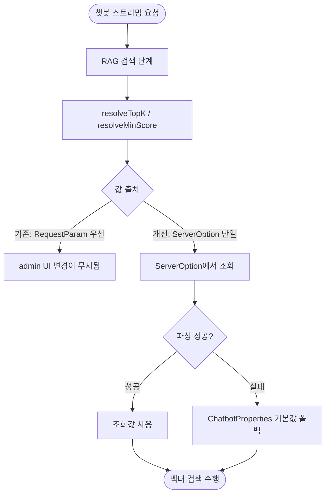

# RAG 검색이 원본 질문을 버려 관련 문서를 못 찾음

## 개요

RAG 챗봇이 문서가 정상 등록돼 있는데도 "관련 문서 없음"으로 답하는 문제와 연관된 RAG 파라미터 정합성을 정리했다. `topK`/`minScore`가 컨트롤러 `@RequestParam`(레거시)과 `ServerOption` 두 경로로 이원화돼 있어, 운영 중 admin UI에서 값을 바꿔도 요청 파라미터가 우선하면 반영되지 않는 구조였다. 레거시 RequestParam 경로를 제거해 RAG 파라미터를 `ServerOption` 단일 출처로 일원화하고, `@EnableCaching`을 활성화한 뒤 설정 저장 시 전체 목록 캐시까지 무효화하도록 정합성을 맞췄다.

## 기능 흐름

## 변경 사항

### RAG 파라미터 단일 출처화

- `Suh-Domain-Chatbot/src/main/java/me/suhsaechan/chatbot/service/ChatbotService.java`: `resolveTopK(Integer)`/`resolveMinScore(Float)`에서 요청 파라미터 우선 분기를 제거하고 `resolveTopK()`/`resolveMinScore()`로 변경. `ServerOption`(`CHATBOT_RAG_TOP_K`, `CHATBOT_RAG_MIN_SCORE`)에서만 조회하고 파싱 실패 시 `ChatbotProperties` 기본값으로 폴백. `chatStream` 오버로드 시그니처에서 `topK`/`minScore` 매개변수 제거.
- `Suh-Web/src/main/java/me/suhsaechan/web/controller/api/ChatbotController.java`: 스트리밍 엔드포인트의 `topK`/`minScore` `@RequestParam` 제거 및 `chatStream` 호출부 정리.

### 캐시 정합성

- `Suh-Web/src/main/java/me/suhsaechan/web/SuhProjectUtilityApplication.java`: `@EnableCaching` 추가로 `ServerOption` 캐싱 활성화.
- `Suh-Common/src/main/java/me/suhsaechan/common/service/ServerOptionService.java`: `setOptionValue`에 `@Caching`으로 해당 키 캐시와 전체 목록(`'all'`) 캐시를 함께 무효화하도록 변경. 설정 저장 후 조회에서 stale 값이 나오지 않도록 정합성 확보.

## 주요 구현 내용

핵심은 **RAG 파라미터의 출처를 ServerOption 하나로 통일**한 것이다. 기존에는 컨트롤러가 `topK=3`, `minScore=0.5`를 `@RequestParam` 기본값으로 받아 서비스로 넘겼고, 서비스의 `resolveTopK(requestedTopK)`가 이 요청값을 ServerOption보다 우선시했다. 그 결과 admin UI에서 값을 조정해도 요청에 기본값이 실려 오면 무시되는, 운영 관점에서 신뢰할 수 없는 구조였다. 레거시 RequestParam과 우선 분기를 걷어내면서, 값은 항상 ServerOption에서 읽고 파싱이 실패할 때만 `ChatbotProperties` 컴파일 기본값으로 폴백한다.

여기에 `@EnableCaching`이 빠져 있어 ServerOption 조회 캐싱이 실제로는 동작하지 않던 점을 함께 잡았다. 캐싱을 켜면서 단건 조회(`serverOption`/키별)와 전체 목록(`'all'`) 캐시가 따로 존재하게 되는데, 저장 시 단건 캐시만 비우면 목록 캐시에 옛 값이 남는다. `@Caching`으로 두 캐시를 동시에 무효화해 "저장 직후 조회 시 변경값이 즉시 보이는" 정합성을 보장했다.

## 주의사항

- 이 변경은 #228에서 지목된 RAG 파라미터 운영화(admin UI 조정 가능) 부분에 해당한다. 의도 분류 프롬프트가 원본 질문을 인공 키워드로 치환하던 `searchQuery` 생성 규칙 자체와, Qdrant 검색 진단 로그 보강은 본 커밋 범위 밖이며 관련 동작은 별도로 확인이 필요하다.
- RAG 파라미터를 요청 단위로 덮어쓰던 API 계약이 사라졌으므로, 외부에서 `topK`/`minScore` 쿼리 파라미터로 호출하던 클라이언트가 있다면 해당 값은 더 이상 적용되지 않고 ServerOption 값이 일괄 적용된다.
