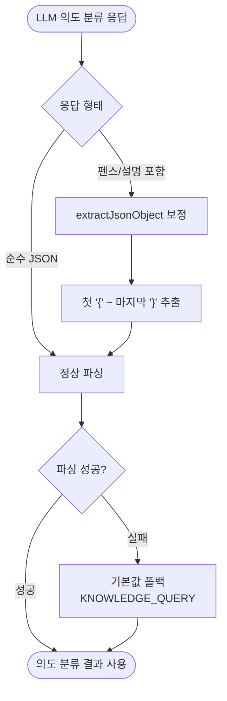

# 챗봇 의도 분류 LLM JSON 파싱이 자주 실패함

## 개요

챗봇 스트리밍 채팅의 의도 분류 단계에서 경량 모델(gemma3:1b)이 강제 JSON 스키마 응답을 안정적으로 생성하지 못해, `ObjectMapper.readValue` 파싱이 자주 실패했다. 모델이 JSON을 마크다운 펜스(```json ... ```)로 감싸거나 앞뒤에 설명 문장을 덧붙이는 것이 주요 원인이었다. 파싱 실패 시 기본값(`KNOWLEDGE_QUERY`, `confidence=0.5`)으로 폴백되며 의도 분류 정확도와 부가 정보(응답 형식·요약)가 손실됐다. LLM 응답에서 JSON 객체 부분만 추출하는 보정 로직을 추가해 파싱 실패 빈도를 줄였다.

## 기능 흐름



## 변경 사항

### 의도 분류 파싱

- `Suh-Domain-Chatbot/src/main/java/me/suhsaechan/chatbot/service/ChatbotService.java`: LLM 응답에서 JSON 객체만 추출하는 `extractJsonObject(String raw)` 메서드 추가. `classifyUserIntentInternal`의 의도 분류 응답을 `ObjectMapper`로 파싱하기 전에 이 보정을 거치도록 변경.

## 주요 구현 내용

`extractJsonObject`는 응답 문자열에서 **첫 번째 `{`부터 마지막 `}`까지**를 잘라내 반환한다. 경량 모델이 JSON 앞에 "다음은 분류 결과입니다:" 같은 설명을 붙이거나, ```json ... ``` 마크다운 펜스로 감싸는 경우가 많은데, 이런 잡음을 제거하고 순수 JSON 객체만 `ObjectMapper`에 전달한다. `{`나 `}`를 찾지 못하면(추출 불가) 원본을 그대로 반환해 기존 동작을 깨지 않는다.

이 보정은 파싱 실패의 가장 흔한 원인(JSON 주변 잡음)을 저비용으로 제거하는 방어 코드다. 모델 자체를 교체하지 않고도 파싱 성공률을 끌어올리는 surgical한 접근으로, 보정 후에도 파싱이 실패하면 기존 폴백(`createFallbackIntent`)이 그대로 동작하므로 사용자 경험에는 영향이 없다.

## 주의사항

- 이 방식은 응답 내에 JSON 객체가 **하나만** 있다고 가정한다(첫 `{` ~ 마지막 `}`). 모델이 여러 JSON 블록을 출력하면 가장 바깥 범위를 한 덩어리로 잡아 파싱이 깨질 수 있으나, 의도 분류 응답 특성상 단일 객체이므로 현재 문제되지 않는다.
- 근본적으로는 경량 모델의 JSON 준수율 자체가 낮은 것이 원인이므로, 파싱 실패율이 여전히 높으면 모델 교체나 few-shot 프롬프트 보강을 별도로 검토한다.
