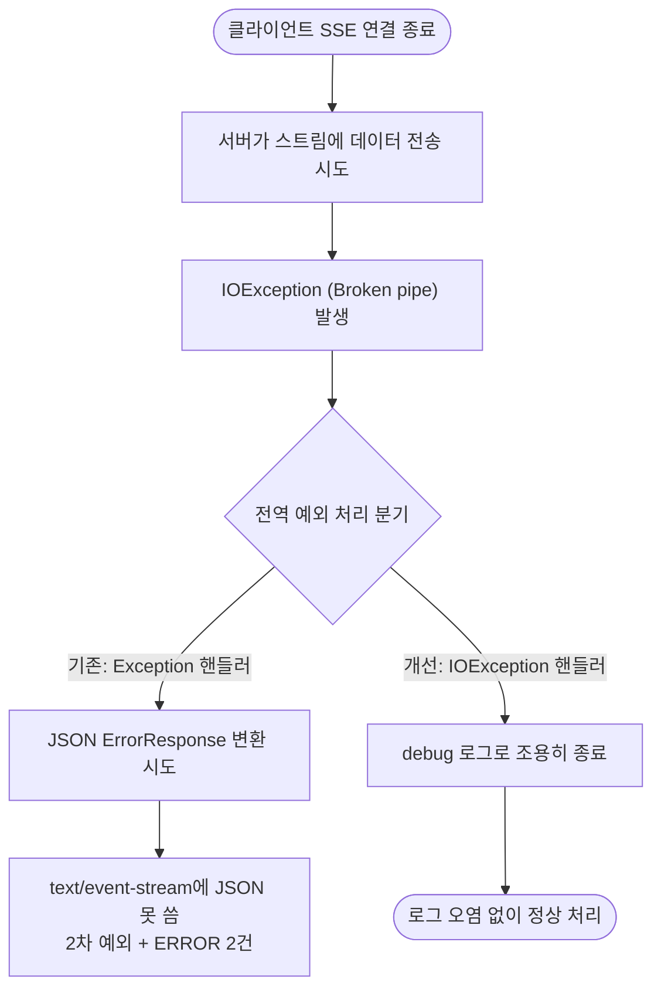

# SSE 로그 스트리밍 연결 종료 시 Broken pipe 예외 처리 오류

## 개요

Docker 컨테이너 실시간 로그 보기(SSE 스트리밍)에서 클라이언트가 화면을 닫거나 새로고침해 연결을 끊으면 서버가 `Broken pipe`(`IOException`) 예외를 던졌다. 이 예외가 전역 예외 처리기(`GlobalExceptionHandler.handleException`)로 전파되면서, `text/event-stream` 응답에 JSON `ErrorResponse`를 쓰려다 `HttpMessageNotWritableException`이라는 **2차 예외**까지 발생해 정상적인 연결 종료가 ERROR 로그 2건으로 기록됐다. 클라이언트 연결 종료를 정상 상황으로 간주하는 전용 핸들러를 추가해, ERROR 스택트레이스 오염과 2차 예외를 모두 차단했다.

## 기능 흐름

## 변경 사항

### 전역 예외 처리

- `Suh-Common/src/main/java/me/suhsaechan/common/exception/GlobalExceptionHandler.java`: `@ExceptionHandler(IOException.class)`를 처리하는 `handleClientAbort` 메서드 추가. 클라이언트 연결 종료로 발생하는 `IOException`(Broken pipe)을 정상 상황으로 간주해 `debug` 레벨 로그만 남기고 응답 변환을 시도하지 않는다.

## 주요 구현 내용

기존에는 모든 예외가 `handleException(Exception e)` 하나로 수렴했다. SSE 스트리밍 도중 발생한 `IOException`도 여기로 들어와 `ResponseEntity<ErrorResponse>`(JSON)를 반환하려 했는데, 응답 Content-Type이 이미 `text/event-stream`으로 고정돼 있어 JSON 컨버터가 동작하지 못하고 `HttpMessageNotWritableException`이 다시 터졌다.

핵심은 **예외 핸들러를 타입별로 분리**한 것이다. `IOException` 전용 핸들러를 더 구체적인(more specific) 타입으로 등록하면, Spring의 `ExceptionHandlerExceptionResolver`가 일반 `Exception` 핸들러보다 이쪽을 우선 매칭한다. 이 핸들러는 반환 타입이 `void`라 응답 본문 변환 자체를 시도하지 않으므로, 이미 끊긴 스트림에 무언가를 쓰려다 발생하던 2차 예외가 원천 차단된다. 클라이언트 연결 종료는 운영상 흔하고 정상적인 상황이므로 로그 레벨도 `ERROR`에서 `debug`로 낮춰 로그 오염을 없앴다.

## 주의사항

- `IOException`을 광범위하게 `debug`로 처리하므로, SSE/스트리밍이 아닌 일반 요청에서 발생하는 진짜 `IOException`도 ERROR로 남지 않게 된다. 현재 이 프로젝트의 `IOException`은 대부분 클라이언트 끊김 맥락이라 트레이드오프가 타당하지만, 향후 파일 I/O 등에서 별도 진단이 필요한 `IOException`이 생기면 더 구체적인 예외 타입이나 메시지 패턴으로 분기를 세분화하는 것을 검토한다.
- 챗봇도 동일한 `SseEmitter` 방식을 사용하므로, 이 전역 핸들러 변경으로 챗봇 스트리밍의 연결 종료 예외도 함께 안전하게 처리된다.
