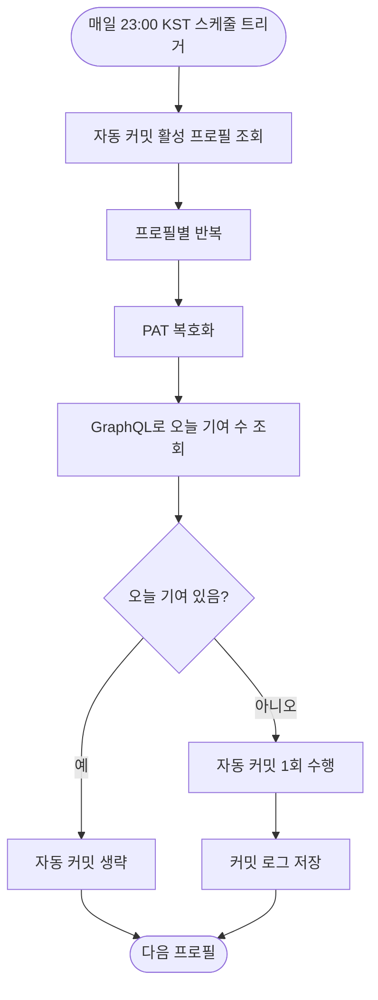

# GrassPlanter 자동 커밋이 "하루 1회" 설정인데 매시간 실행됨

## 개요

GrassPlanter(GitHub 잔디 자동 커밋) 기능이 화면상 "하루 1회" 설정인데도 매시간 정각마다 자동 커밋을 실행하던 버그를 수정했다. 스케줄러를 매일 23시 1회 실행으로 바꾸고, 오늘 기여 여부 판정을 부정확한 공개 프로필 HTML 스크래핑에서 GitHub GraphQL `contributionsCollection` API 기반으로 교체해 매시간 중복 커밋을 차단했다.

## 문제

- **증상**: 커밋 로그가 매시간 1줄씩(00:00, 01:00, 02:00 …) 쌓이고, 모든 로그의 기여 레벨이 계속 `0`으로 찍혔다.
- **원인 1**: 스케줄러 cron이 `0 0 * * * *`(매시간 정각)으로 하드코딩되어 화면의 "하루 1회"/"목표 레벨" 설정을 전혀 참조하지 않았다.
- **원인 2**: 매시간 깨어나 "오늘 기여 레벨 < 목표 레벨"이면 커밋하는 구조인데, 오늘 기여 여부를 GitHub 공개 프로필 페이지 HTML 스크래핑으로 확인했다. 방금 한 커밋이 즉시 반영되지 않아 매시간 "목표 미달"로 판단해 중복 커밋했다.
- **원인 3**: 스크래핑 방식은 private 기여를 누락하고, GitHub HTML 구조가 바뀌면 항상 0으로 떨어져 매시간 커밋되는 취약점이 있었다.

## 기능 흐름

## 변경 사항

### 스케줄러 실행 주기

- `GrassService.executeAutoCommits()`: cron을 `0 0 * * * *`(매시간) → `0 0 23 * * *`, zone `Asia/Seoul`(매일 23시 1회)로 변경. 서버 타임존과 무관하게 KST 23시에 1회만 실행된다.

### 자동 커밋 판단 조건

- 판단 조건을 "목표 레벨 미달"에서 "오늘 기여 수 0 이하"로 변경. 오늘 잔디가 이미 있으면 생략하고, 없을 때만 1번 커밋한다. 사용자가 낮에 직접 커밋했다면 자동 커밋이 발생하지 않는다(잔디 빵꾸 방지).
- PAT 복호화를 분기 위로 이동해 기여 조회와 커밋이 동일한 PAT를 공유하도록 정리했다.

### 기여 확인 방식 교체 (스크래핑 → GraphQL)

- `getTodayContributionCount()` 신규: GitHub GraphQL `contributionsCollection` API로 해당 날짜의 기여 수를 조회한다. PAT 인증을 사용하므로 private 기여까지 포함되며, 잔디 그래프와 동일한 데이터 원본을 사용해 정확하다. 조회 구간은 KST 기준 당일 00:00~23:59로 지정한다.
- `extractContributionCountForDate()` 신규: GraphQL 응답에서 대상 날짜의 `contributionCount`를 추출한다.
- 기존 스크래핑 메서드 `checkContributionLevel()`은 PAT가 없는 공개 기여도 조회 컨트롤러가 사용하므로 그대로 보존했다.

### 회귀 테스트

- `GrassServiceParseTest` 신규: `extractContributionCountForDate`의 파싱 정확성을 검증하는 테스트 6종(기여 있음/없음/해당 날짜 없음/여러 날짜 매칭/두 자리 수/빈 응답). Spring 컨텍스트 없이 순수 파싱 로직만 검증한다.

## 주요 구현 내용

- **타임존 명시**: cron에 `zone = "Asia/Seoul"`을 지정해 배포 서버 타임존과 무관하게 KST 기준으로 동작하도록 했다.
- **잔디 동일 데이터 원본**: GraphQL `contributionsCollection`은 GitHub 잔디 그래프를 그리는 바로 그 데이터다. 스크래핑이 놓치던 private 기여를 포함하고 HTML 구조 변경에도 영향받지 않는다.
- **파싱 버그 발견·수정**: 테스트 작성 과정에서, 응답 항목이 `{"date":...,"contributionCount":...}` 순서임에도 날짜 마커 앞쪽의 count를 찾던 오류(`lastIndexOf`)를 발견해 날짜 마커 뒤쪽 count를 찾도록(`indexOf`) 수정했다. 수정 후 테스트 9/9 통과.

## 영향 파일

- `Suh-Domain-GrassPlanter/src/main/java/me/suhsaechan/grassplanter/service/GrassService.java`
- `Suh-Domain-GrassPlanter/src/test/java/me/suhsaechan/grassplanter/service/GrassServiceParseTest.java` (신규)

## 주의사항

- 자동 커밋 정확도는 프로필 PAT의 권한과 GitHub 프로필의 "Private contributions" 표시 설정에 의존한다. private 기여를 잔디에 표시하지 않는 설정이면 해당 기여는 0으로 집계될 수 있다.
- `targetCommitLevel`, `dailyCommitGoal`, `GrassSchedule` 엔티티는 이번 변경 범위 밖이라 그대로 두었다. UI의 "목표 레벨" 표시는 현재 동작에 영향을 주지 않는 표시값이다.
- 배포 검증: deploy 브랜치의 `GrassService.java`에 `cron = "0 0 23 * * *"`가 반영된 것을 확인했다(버전 v2.5.75).
