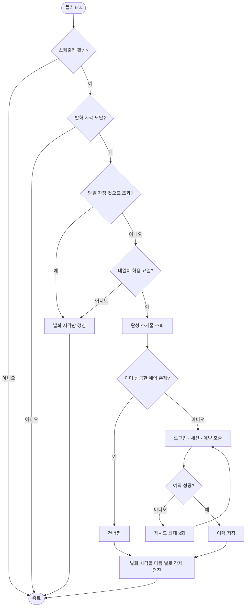

# 소만사 버스 자동예약 발화 누락 및 중복 발화 문제

## 개요

소만사 버스 자동예약 스케줄러가 며칠간 정상 동작하지 않았다. 운영 서버 로그와 DB 이력을 확인한 결과, 원인은 발화 시각 재계산 로직 하나에서 갈라진 두 가지 반대 증상이었다. 9월 7일 밤에는 발화가 아예 일어나지 않아 9월 8일 좌석 예약이 통째로 누락됐고, 9월 8일 밤에는 같은 예약 API가 세 번 호출됐다. 여기에 재시도가 없고 예약 응답 판정이 느슨한 문제가 겹쳐 실패가 그대로 방치되거나 성공으로 기록되고 있었다.

## 문제 확인 근거

운영 DB `somansa_bus_reservation_history` 조회 결과:

| reservation_date | is_success | executed_at |
|---|---|---|
| 2026-09-09 | t | 2026-09-08 23:51:26 |
| 2026-09-09 | t | 2026-09-08 23:51:26 |
| 2026-09-09 | t | 2026-09-08 23:41:26 |
| 2026-09-09 | t | 2026-09-08 23:41:26 |
| 2026-09-09 | t | 2026-09-08 23:31:25 |
| 2026-09-09 | t | 2026-09-08 23:31:25 |
| 2026-09-07 | t | 2026-09-06 23:51:22 |

9월 9일 좌석은 10분 간격으로 세 번 예약됐고, 9월 8일 좌석은 이력 자체가 없다.

컨테이너 로그:

```
2026-09-08T00:01:23  WARN  발화 시각 컷오프 초과 - skip (nextFireAt: 2026-09-07T23:52)
2026-09-08T23:31:25  INFO  state 갱신 완료 - fired: true, nextFireAt: 2026-09-08T23:25
```

## 기능 흐름



## 변경 사항

### 스케줄러 발화 시각 계산

- `SomansaBusSchedulerService`: `computeNextFireAt`에 `forceNextDay` 인자를 추가했다. 발화 직후 호출에서는 무조건 다음 날로 전진시킨다. 기존에는 발화 창 한가운데서 같은 날 랜덤 시각을 다시 뽑아 과거 시각이 나왔고, 그 결과 자정까지 매 폴링마다 재발화했다.
- `SomansaBusSchedulerService`: 랜덤 발화 창의 끝을 `toHour:59`에서 `toHour:00`으로 좁혔다. 기본 설정 기준 발화 시각은 22시대 안에서만 뽑히며 자정까지 최소 1시간 여유가 생긴다.

### 폴링 주기

- `SomansaBusSchedulerPoller`: 고정 지연을 10분에서 2분으로 줄였다. 발화 시각과 폴링 격자 사이 틈을 좁혀 누락 여지를 없앤다.

### 예약 실행

- `SomansaBusReservationService`: 같은 멤버·노선·예약일에 성공 이력이 있으면 외부 예약 API를 호출하지 않는다. 스케줄러가 어떤 이유로 재발화해도 중복 예약이 발생하지 않는 2차 방어선이다.
- `SomansaBusReservationService`: 예약 실패 시 3초 간격으로 최대 3회 재시도한다. 기존에는 실패하면 다음 날까지 복구 기회가 없었다.
- `SomansaBusReservationService`: `@Transactional`을 제거해 외부 HTTP 호출이 DB 커넥션을 점유하지 않게 했다. 대신 연관 엔티티를 미리 로딩한다.
- `SomansaBusScheduleRepository`: 트랜잭션 밖 사용을 위해 `JOIN FETCH` 조회 메서드를 추가했다.
- `SomansaBusReservationHistoryRepository`: 중복 예약 판정용 존재 확인 메서드를 추가했다.

### 외부 API 연동

- `SomansaBusApiService`: 예약 응답의 `d` 값이 정수이고 양수일 때만 성공으로 판정한다. 기존에는 파싱 실패 시 기본값 0을 성공으로 처리해 실패가 성공으로 기록됐다.
- `SomansaBusApiService`: 싱글톤 필드로 공유하던 `OkHttpClient`를 제거하고, 예약 흐름마다 독립 세션을 생성해 넘기도록 바꿨다. 노선 동기화 흐름도 같은 세션을 공유하도록 함께 수정했다.
- `SomansaBusHttpClient`: 쿠키 저장소가 같은 이름의 쿠키를 교체하도록 하고 접근을 동기화했다. 기존에는 쿠키를 무한 누적해 낡은 세션 쿠키가 함께 전송될 수 있었다.

### 날짜 기준

- 예약일과 실행 시각 계산을 모두 `Asia/Seoul` 기준으로 통일했다. 스케줄러는 서울 기준인데 예약 서비스는 서버 기본 시간대를 쓰고 있었다.

## 주요 구현 내용

핵심은 발화 시각을 다시 계산하는 시점의 기준일이다. 기존 코드는 호출 맥락과 무관하게 "지금 시각이 오늘 창의 끝을 지났는가"만 봤다. 발화는 창 안에서 일어나므로 이 조건은 발화 직후에 항상 거짓이 되고, 같은 날이 후보로 남아 과거 시각이 뽑혔다. 발화 직후와 그 외 상황을 호출부에서 구분해 전달하도록 바꾼 것이 이번 수정의 중심이다.

두 번째 축은 발화 창과 폴링 격자의 관계다. 창의 끝이 자정 직전이면 어떤 폴링 주기를 쓰더라도 마지막 폴링과 자정 사이에 사각지대가 생긴다. 창을 앞으로 당기고 폴링을 촘촘히 해 이 사각지대를 없앴다.

## 검증

- `computeNextFireAt` 발화 직후 다음 날 전진 회귀 테스트 추가
- 발화 시각이 항상 22시에서 23시 사이인지 200회 반복 검증 테스트 추가
- `Suh-Domain-Somansa-Bus` 전체 테스트 통과, `Suh-Web` 컴파일 통과
- Blue-Green 배포 성공, green 컨테이너 정상 기동 확인

## 주의사항

- 배포 시점의 DB에는 구버전 로직이 계산한 발화 시각 `2026-09-09 23:01`이 남아 있다. 새 창 범위 밖이지만 2분 폴링이 충분히 잡을 수 있는 시각이며, 오늘 밤 1회 발화 후에는 새 로직이 다음 날로 전진시킨다.
- 발화 창 설정을 바꿀 때 종료 시각을 23시로 두면 실제 발화는 23시 정각까지만 일어난다. 창의 끝을 자정에 가깝게 밀면 이번에 고친 누락 문제가 다시 생길 수 있다.
- 9월 9일 좌석에 남은 중복 예약 3건은 코드 수정으로 되돌아가지 않는다. 외부 예약 시스템에서 직접 확인이 필요하다.
- 세션 생성 응답은 여전히 HTTP 상태 코드로만 판정한다. 응답 본문 형식을 확인하지 못해 판정 조건을 추가하지 않았고, 대신 본문을 로그에 남기도록 했다.
