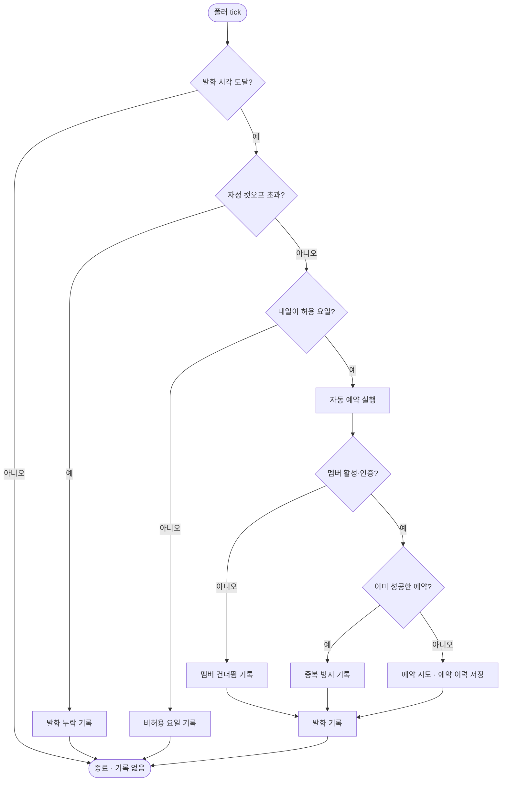

# 자동예약 스케줄러 실행 기록 추가 및 대시보드 노출

## 개요

자동 예약이 실행되지 않은 날에 화면과 DB 어디에도 흔적이 남지 않던 문제를 해결했다. 이슈 #248의 9월 7일 누락이 대표 사례로, 폴러와 tick은 정상 동작했지만 발화 시각을 놓쳐 건너뛴 탓에 예약 시도가 없었고 그래서 이력 행도 생기지 않았다. 트리거는 됐으나 예약까지 가지 못한 사건을 별도 이벤트로 기록하고 대시보드에 노출한다.

## 기능 흐름



## 변경 사항

### 이벤트 모델

- `SomansaBusSchedulerEventType`: 이벤트 유형 enum을 추가했다. 발화, 발화 누락, 비허용 요일, 멤버 건너뜀, 중복 방지, 실행 오류, 상태 오류 일곱 가지이며 각 유형이 사용자 조치가 필요한 사건인지 여부를 함께 가진다.
- `SomansaBusSchedulerEvent`: 유형, 대상일, 내용, 발생시각을 담는 엔티티를 추가했다. 예약 이력 테이블은 대시보드 주간 통계 집계에 쓰이므로 성격이 다른 행을 섞지 않고 테이블을 분리했다.
- `SomansaBusSchedulerEventRepository`: 최근 30건 조회 메서드를 추가했다.
- `V2_5_89__create_somansa_bus_scheduler_event.sql`: 테이블과 발생시각 내림차순 인덱스를 생성한다. 완전 초기화 상태도 커버하도록 조건부 생성문만 사용했다.

### 기록 지점

- `SomansaBusSchedulerEventService`: 기록과 조회를 담당한다. 이벤트 기록 실패가 예약 자체를 막으면 안 되므로 예외를 삼키고 로그만 남긴다.
- `SomansaBusSchedulerService`: 상태 로드 실패, 컷오프 누락, 비허용 요일, 발화 성공, 실행 오류 다섯 지점에서 기록한다. 발화 시각에 도달한 판단만 남기므로 2분 폴링이 행을 쌓지 않는다.
- `SomansaBusReservationService`: 멤버 건너뜀과 중복 방지 두 지점에서 기록한다. 예약일을 메시지에 함께 남기기 위해 멤버 검사보다 예약일 계산을 먼저 수행하도록 순서를 조정했다.

### 조회 API

- `SomansaBusResponse`: 스케줄러 이벤트 목록 필드를 추가했다.
- `SomansaBusController`: 최근 이벤트 조회 엔드포인트를 추가했다.

### 화면

- `somansaBusDashboard.html`: 스케줄러 실행 기록 섹션을 추가했다. 발생시각, 유형 배지, 대상일, 내용을 보여주며 새로고침 버튼을 둔다. 누락과 오류는 오류 배지, 발화는 성공 배지, 정상 스킵은 중립 배지로 구분한다. 기존 예약 기록 테이블에는 사유 컬럼을 추가해 실패 원인이 대시보드에서 바로 보이게 했다.
- `header.html`, `messages_ko.properties`, `messages_en.properties`: 신규 문구를 한국어와 영어로 추가했다.

## 주요 구현 내용

핵심 판단은 무엇을 기록하지 않을 것인가였다. 폴러는 2분마다 도는데 모든 tick을 남기면 하루 720건이 쌓여 정작 중요한 사건이 묻힌다. 그래서 발화 시각에 도달한 tick의 판단만 기록한다. 이 조건에 걸리는 경우는 하루 한 번뿐이라 이벤트 테이블이 사람이 훑어볼 수 있는 밀도를 유지한다.

스케줄러가 꺼져 있는 경우는 기록하지 않는다. 사용자가 직접 끈 상태라 사고가 아니고, 비활성 기간에는 발화 시각이 갱신되지 않아 매 tick 기록 대상이 되어버리기 때문이다.

테이블을 분리한 이유는 예약 이력에 멤버와 노선 외래키가 있고 주간 예약 통계가 이 테이블을 집계하기 때문이다. 스케줄러 레벨 사건은 멤버와 노선이 없어 통계를 오염시킨다.

## 검증

- 발화를 놓친 상황을 만들어 tick을 실행하고 이벤트가 기록되는지 확인하는 회귀 테스트를 추가했다. 실제 기록된 내용은 다음과 같다.

```
발화 예정 시각 2026-09-09T22:00 을 놓쳐 당일 자정을 넘겼습니다. 해당 날짜 예약이 실행되지 않았습니다.
```

- `Suh-Domain-Somansa-Bus` 전체 테스트 통과, 두 모듈 컴파일 통과
- CSS 재생성 결과 변경 없음. 사용한 클래스가 기존 산출물에 모두 포함되어 있다
- Blue-Green 배포 성공, 마이그레이션 2.5.89 적용 확인, 테이블 7개 컬럼 생성 확인
- 배포 전후 스케줄러 상태가 유지되어 당일 발화 예정 시각이 그대로 남아 있다

## 주의사항

- 이벤트 테이블에는 아직 행이 없다. 첫 기록은 배포 후 첫 발화 시점에 생기며, 그 전까지 화면에는 기록 없음으로 표시된다.
- 이벤트 보관 기간에 제한을 두지 않았다. 하루 몇 건 수준이라 당장은 문제가 없지만, 장기적으로는 정리 정책이 필요할 수 있다.
- 비허용 요일 기록은 주말마다 쌓인다. 정상 동작이지만 화면에서 노이즈로 느껴지면 유형별 필터를 추가하는 편이 낫다.
